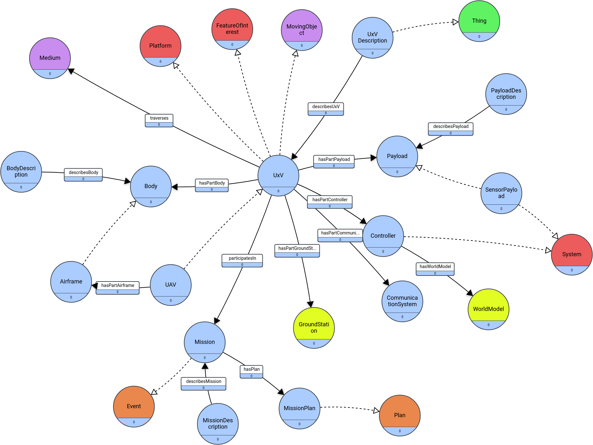

Contribute to the LANDRS Ontology: [schema.landrs.org](schema.landrs.org)

## How to contribute:

Tutorial on using the ontology manager coming soon

## History of LANDRS development
A key part of the LANDRS toolkit is the provision of key missing terms for capturing Drone metadata.  Through a series of hackathons and community engagement the following has been developed.  However, we are seeking further commentary and engagement and expect this ontology to evolve further.  To facilitate this engagement we are using Fuseksi's Ontology Manager hosted: [schema.landrs.org](schema.landrs.org)

Vocabulary, Taxonomy and Ontology Development for LANDRS
This work is attempting to fill in missing terms where there isn't an appropriate existing ontology.
Github [https://github.com/landrs-toolkit/LANDRS-o](https://github.com/landrs-toolkit/LANDRS-o)

### Initial Strawman design:

#### Key:
- Green: OGC SensorThing
- Red: OGC SOSA
- Blue: LANDRS
- Orange:
- Purple:

### In Progress Drone representation
Uses OGC SOSA and STEP
