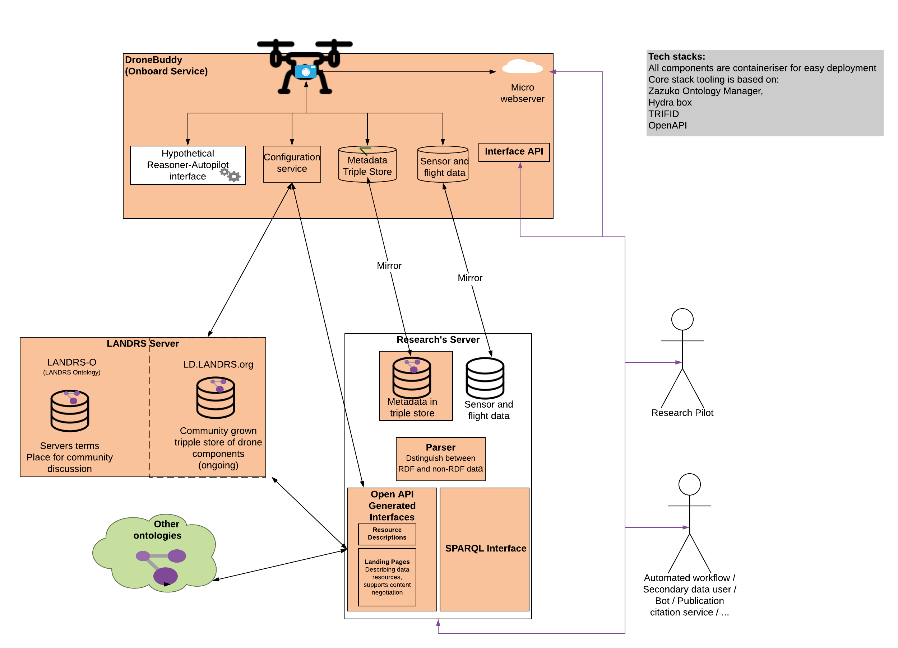

## DroneDataBuddy Development update
The demonstrator app serves both to demonstrate how linked data could be used to provide a number of data features research drones need, and a exploration space to refine the design of LANDRS services.
### 1 Value of LD demonstration
Automated annotation of scientific data with machine readable terms making these data queriable, and available to reasoners, search bots, and automated workflows 

### 2: LANDRS Design exploration
A SPARQL endpoint will let users try out different queries allowing developers to better understand what types and forms of queries we the ultimate landing pages should be able to generate from
 

See more on 